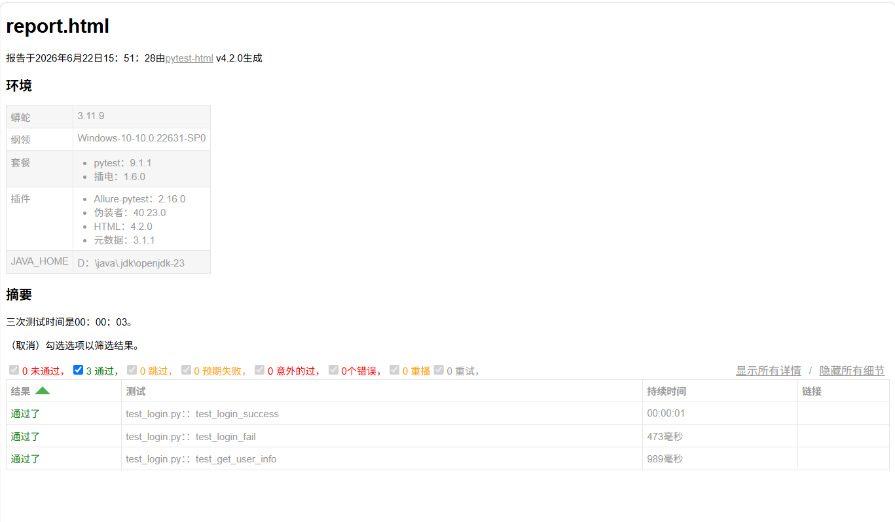
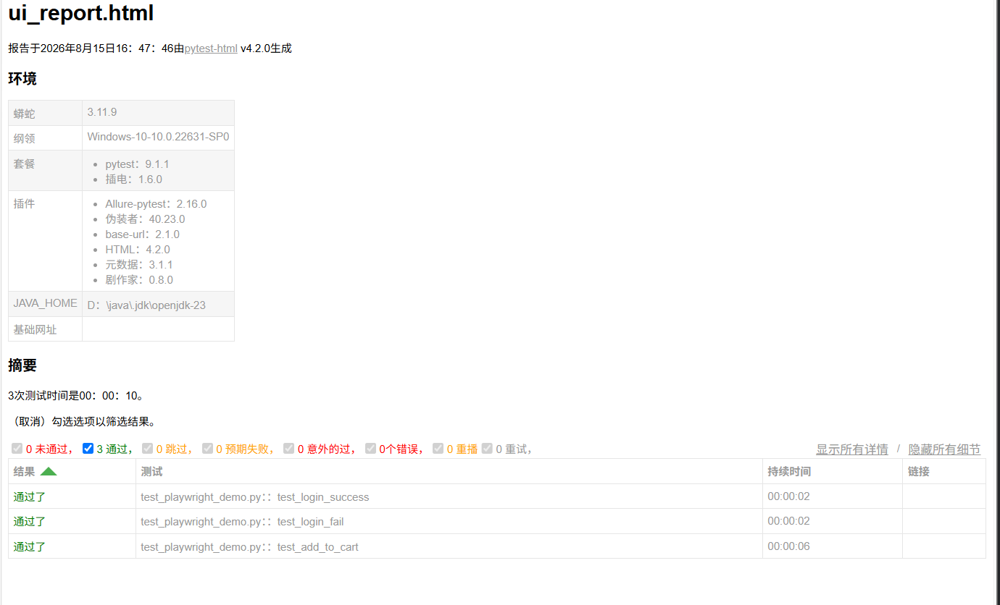

# 接口自动化测试框架

## 项目简介
基于 Python + Pytest 的接口自动化测试框架，支持数据驱动、日志记录、测试报告和自动清理。

## 技术栈
- Python 3.11
- Pytest
- Requests
- PyYAML
- loguru
- pytest-html
- playwright

## 项目结构

```text
pythonProject1/
├── api_client.py          # HTTP 请求封装
├── config.py              # 配置管理
├── conftest.py            # Pytest fixture 管理
├── test_data.yaml         # 数据驱动
├── tests/
│   ├── test_login.py      # 登录测试
│   ├── test_cart.py       # 购物车测试
│   └── test_grade_query.py # 教务系统查成绩测试
├── ai_case_generator.py   # AI 辅助生成用例
├── Dockerfile             # 容器化配置
├── docker-compose.yml     # 一键启动测试环境
└── .github/
    └── workflows/
        └── test.yml       # CI 自动跑测试
```

## 运行测试

```bash
pytest test_login_data_driven.py -v -s
pytest test_add_to_cart.py -v -s
```

## 接口测试
```bash
pytest test_login_data_driven.py -v -s
pytest test_add_to_cart.py -v -s
```
## UI测试
```bash
pytest test_playwright_demo.py -v -s
```

## 测试报告

### 1.接口测试报告
```bash
pytest test_login_data_driven.py --html=report.html --self-contained-html
```

### 2.UI测试报告
```bash
pytest test_playwright_demo.py --html=ui_report.html --self-contained-html
```

## 使用Docker运行（推荐）
```bash
docker compose up --build
```

## 测试报告与日志

### 接口测试报告


### UI 测试报告


### 日志文件
每次运行测试时，`loguru` 会自动生成日志文件，保存在 `logs/` 目录下，例如 `logs/test_20260911.log`。

### 失败截图
UI 测试失败时，会自动截图保存，方便定位问题。


## 项目亮点
- 数据驱动设计：测试数据与代码分离
- 自动清理：使用 yield fixture 保持测试环境干净
- 日志与报告：集成 loguru 和 pytest-html
- 可复用客户端：封装 APIClient，避免重复编写请求代码